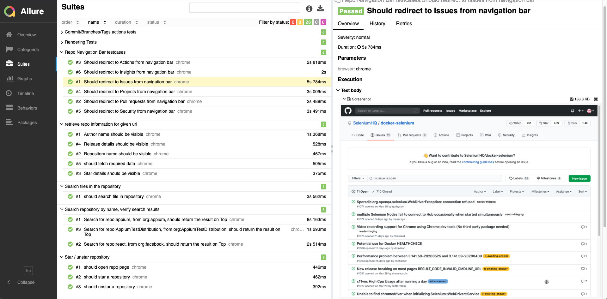
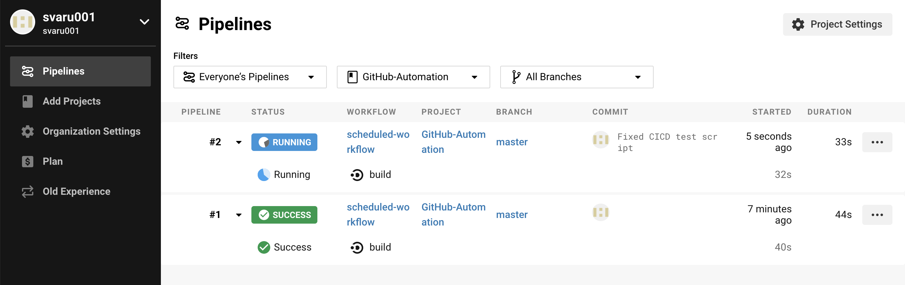
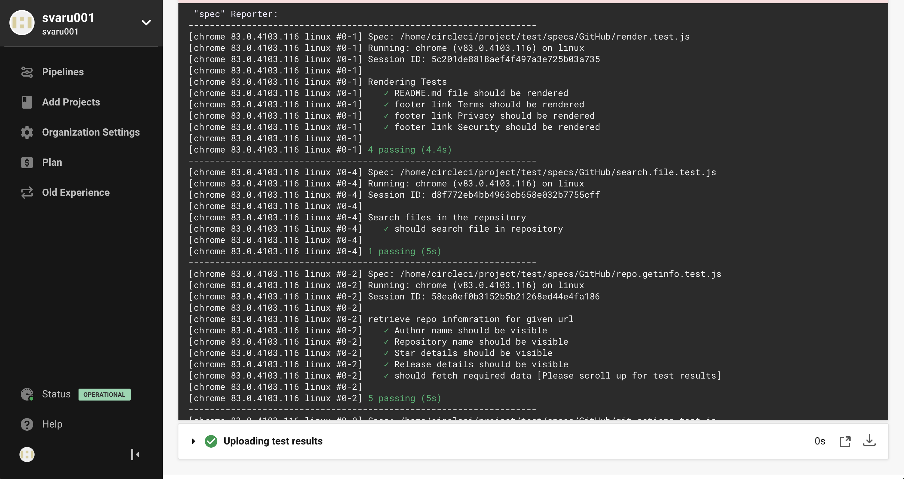

# GitHub Automation Framework


This repository is created to functional test automation of [GitHub.com](https://github.com).

Tecnologies used:
- [JavaScript (ECMAScript 6)](http://es6-features.org/#Constants)
- [Page Object Model](https://medium.com/tech-tajawal/page-object-model-pom-design-pattern-f9588630800b)
- [Sauce Labs Cloud](https://saucelabs.com/)
- [WebDriver.io](https://webdriver.io)
- [Docker](https://docker.com)
- [Selenium for docker](https://github.com/SeleniumHQ/docker-selenium)
- [Allure Reporter](https://docs.qameta.io/allure/)
- [CircleCI CICD Tool](https://circleci.com/)

## Pre-requisites
* NodeJS
* Docker

## Usage

Clone this Repository

```sh
git clone git@github.com:svaru001/GitHub-Automation.git
```

Install Dependancies

```sh
npm install
```

Start Selenium Hub Locally

```sh
npm run docker-selenium-hub 
```

Run Console app to retrieve repo details

```sh
npm run test1
```

Run all GitHub testcases

```sh
npm run all-tests
```

Run all GitHub testcases on Saucelab Cloud (Run More than 10 various capabilities (OS Versions))

```sh
npm run saucelab-tests
```
## Allure reports (default)

you will be redirected to Allure HTML reporter after Test execution is finished.
You can Run Report explicitly 
```sh
npm run report
```


## Running test suite

To run complete test suite:
- Open terminal.
- Navigate to the path the project was cloned in.
- Run `npm run all-tests`
- Run `npm run report`

## Report Preview



## CircleCI CICD Workflow Preview
- Scheduled Workflow
- Git Action Workflow (Commit/ PR raised)



## CircleCI Test Results


